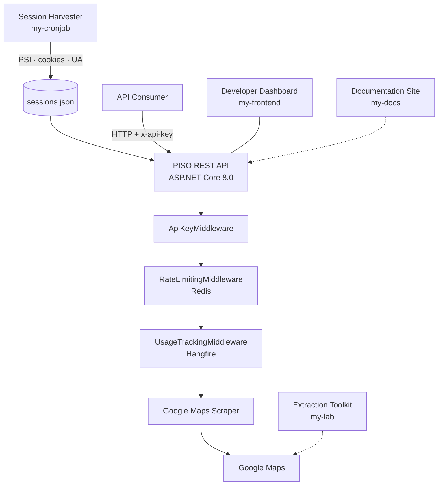

# PISO

**PISO API** — a SaaS that provides real-time autocomplete, search, and place detail data from Google Maps through a simple REST API. Free API key, integrate in 30 seconds.

Official Website: [pisomap.tech](https://www.pisomap.tech/)
Docs: [docs.pisomap.tech](https://docs.pisomap.tech/)

---

## How It Works



---

## Tech

| Layer | Stack |
|-------|-------|
| **API** | ASP.NET Core 8.0, C#, RestSharp, AutoMapper |
| **Auth** | Firebase JWT + API key middleware |
| **Rate Limiting & Cache** | Redis (StackExchange.Redis) |
| **Background Jobs** | Hangfire |
| **Database** | Google Cloud Firestore |
| **Session Harvester** | Node.js 22, TypeScript 6, CloakBrowser (C++ stealth engine) |
| **Dashboard** | Next.js 16, React 19, Redux Toolkit, Recharts |
| **Docs** | Next.js 16, Fumadocs, Orama, Shiki |
| **Infra** | Docker, GitHub Actions (6h cron) |
| **Tooling** | [OpenCode](https://opencode.ai) — agentic CLI |
| **BI** | Microsoft Power BI |

---

## Document

- [**my-backend/PISO**](my-backend/PISO/README.md) — .NET 8, C# — REST API with auth, rate limiting, scraping
- [**my-cronjob**](my-cronjob/README.md) — Node 22, TypeScript — Stealth browser session harvester
- [**my-frontend**](my-frontend/README.md) — Next.js 16, React 19 — Developer dashboard
- [**my-docs**](my-docs/README.md) — Next.js 16, Fumadocs — Bilingual documentation site
- [**my-lab**](my-lab/README.md) — Python 3.14 — Google Maps response extraction toolkit
- [**my-skills**](my-skills/google-maps-search/SKILL.md) — OpenCode skill files

---

## API Endpoints

| Method | Path | Description |
|--------|------|-------------|
| `GET` | `/api/maps/autocomplete?q=&lat=&lng=` | Place autocomplete suggestions |
| `GET` | `/api/maps/search?q=&lat=&lng=` | Local search results |
| `GET` | `/api/maps/place?data_id=&lat=&lng=` | Place detail, hours, reviews, photos |
| `GET` | `/api/users/profile` | User profile |
| `POST` | `/api/users/signup` | Sign up / sign in |
| `POST` | `/api/users/regenerate-key` | Regenerate API key |
| `GET` | `/api/users/logs` | Usage logs |
| `GET` | `/api/users/daily-usage` | Daily usage stats |

All `/api/maps/*` endpoints require `x-api-key` header.

---

## Testing with Postman

Import the collection to quickly test all endpoints:

```
File → Import → postman/PISO.postman_collection.json
```

Then set these collection variables:

| Variable | Default | Description |
|----------|---------|-------------|
| `base_url` | `http://localhost:5143` | API server address |
| `api_key` | — | Your API key from the dashboard |
| `lat` / `lng` | `10.823` / `106.629` | Default coordinates (Ho Chi Minh City) |
| `data_id` | — | Place ID from search results |

---

## Power BI Integration

Connect PISO API data directly into Power BI.

1. Open Power BI Desktop → **Get Data** → **Web** → **Advanced**
2. Enter the URL and add header `x-api-key: your-api-key`

| Endpoint | Description |
|----------|-------------|
| `http://localhost:5143/api/users/logs` | Paginated request history |
| `http://localhost:5143/api/users/daily-usage` | Time-series usage stats |

---

## Quick Start

```bash
# API server
cd my-backend/PISO
dotnet restore && dotnet run --project PISO.WebApp

# Harvest sessions
cd my-cronjob
npm install && npm run harvest-sessions

# Dashboard (requires .env.local with Firebase config)
cd my-frontend
npm install && npm run dev

# Documentation
cd my-docs
npm install && npm run dev
```

---

## Architecture

Onion architecture with dependencies flowing inward:

```
PISO.WebApp              ASP.NET Core host, middleware pipeline, Program.cs
PISO.Presentation        Controllers
PISO.Service             Business logic
PISO.Service.Contracts   Service interfaces
PISO.Contracts           Repository & infrastructure interfaces
PISO.Repository          Firestore data access
PISO.GoogleMapService    Request executor, parser, session helper
PISO.HttpClient          HTTP client pool with proxy rotation
PISO.RedisService        Redis caching
PISO.LoggerService       NLog logging
PISO.HangfireService     Job scheduling
PISO.Entities            Domain models (innermost core)
PISO.Shared              DTOs, constants, attributes
```

---

## Support

| Channel | |
|---------|-|
| **Email** | [quochbcontact@gmail.com](mailto:quochbcontact@gmail.com) |

---

## License

Open source for education. [MIT License](LICENSE) — see [my-backend/PISO/LICENSE](my-backend/PISO/LICENSE).
