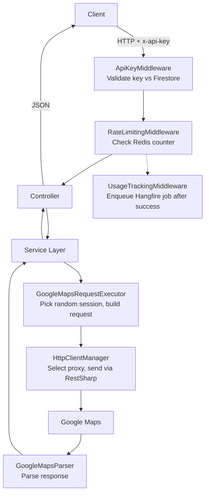

# PISO

Backend API for PISO API. Scrapes and serves Google Maps autocomplete, search, and place detail data.

## Features

- **Autocomplete** — Suggest places as users type
- **Place Search** — Find businesses near a location
- **Place Detail** — Get ratings, hours, reviews, and photos
- **API Key Auth** — Secure access with simple key-based auth
- **Rate Limiting** — Control usage per plan limits via Redis
- **Usage Tracking** — Log every request automatically
- **Proxy Rotation** — Rotate IPs to avoid being blocked
- **Session Rotation** — Rotate cookies and user agents per request

## Tech Stack

- **Runtime** — ASP.NET Core 8.0, C#
- **Database** — Google Cloud Firestore
- **Cache & Rate Limiting** — Redis (StackExchange.Redis)
- **Background Jobs** — Hangfire
- **Object Mapping** — AutoMapper
- **HTTP Client** — RestSharp with proxy/session rotation
- **Auth** — Firebase JWT + API key middleware
- **API Versioning** — Header-based via `Microsoft.AspNetCore.Mvc.Versioning`
- **Logging** — NLog
- **Docs** — Swagger (Swashbuckle), OpenAPI

## Architecture & Design Patterns

- **Onion Architecture** — Dependencies flow inward: `WebApp` → `Presentation` → `Service`/`Infrastructure` → `Contracts` → `Entities`/`Shared` (innermost core)
- **Domain Core** — `PISO.Entities` (models, config) and `PISO.Shared` (DTOs, constants, attributes) have zero project dependencies
- **Interface Layer** — `PISO.Contracts` (repo & infra interfaces) and `PISO.Service.Contracts` (service interfaces) define boundaries
- **Dependency Injection** — All concrete implementations wired in `PISO.WebApp` (composition root)
- **Repository Pattern** — Data access abstracted behind `IRepositoryManager`/`IFirestoreRepository`
- **Service Layer** — Business logic in `PISO.Service`, consumed via interfaces by controllers
- **Middleware Pipeline** — API key validation → rate limiting → usage tracking → controller
- **Scraper Pattern** — Dedicated `GoogleMapsRequestExecutor` + `GoogleMapsParser` per endpoint
- **Proxy & Session Rotation** — `HttpClientManager` pool with rotating proxies; `SessionHelper` rotating cookies/UA per request

## How It Works



## Prerequisites

- **[.NET 8.0 SDK](https://dotnet.microsoft.com/download/dotnet/8.0)** — required to build and run the project
- **Google Cloud project with Firestore** — primary database for users, usage data, and API keys
- **Firebase project** — provides JWT-based authentication for API users
- **Redis** — used for rate limiting, caching, and usage tracking (any hosted instance works)
- **Google Maps session cookies** — required for scraping; place in `Data/google-sessions.json`
- **Proxy list** _(optional)_ — for IP rotation to avoid rate limits; place in `Data/proxy.txt`
- **Docker** _(optional)_ — for containerized deployment

## Install

```bash
# 1. Clone
git clone <repo-url>
cd PISO

# 2. Restore & build
dotnet restore
dotnet build

# 3. Set up data files
mkdir -p PISO.WebApp/Data
# Add proxies to PISO.WebApp/Data/proxy.txt
# Add sessions to PISO.WebApp/Data/google-sessions.json

# 4. Configure secrets in PISO.WebApp/appsettings.Development.json
#    - Firebase credentials
#    - Redis URL
```

## Configuration

All configuration is in `appsettings.json` with secrets overridden in `appsettings.Development.json` (gitignored).

### Data Files

| File | Description | Gitignored |
|---|---|---|
| `Data/proxy.txt` | Proxy addresses, one per line (`host:port:user:pass`) | Yes |
| `Data/google-sessions.json` | Array of session objects with cookies, user agents, PSI tokens | Yes |
| `appsettings.Development.json` | Local overrides for Firebase, Redis, and other secrets | Yes |

### Config Sections (in `appsettings.json`)

| Key | Description |
|---|---|
| `Firebase` | Firebase project credentials (`project_id`, `private_key`, etc.) |
| `Redis:Url` | Redis connection URL |
| `Proxy:Enabled` | Enable/disable proxy rotation |
| `Proxy:FilePath` | Path to proxy file (default: `Data/proxy.txt`) |
| `GoogleSessions:FilePath` | Path to sessions file (default: `Data/google-sessions.json`) |

## Local Development

```bash
# 1. Set up data files (see Data/ directory)
#    Add proxies to Data/proxy.txt
#    Add sessions to Data/google-sessions.json

# 2. Configure secrets in appsettings.Development.json
#    - Firebase credentials
#    - Redis URL

# 3. Run
dotnet run --project PISO.WebApp

# Or with hot-reload
dotnet watch run --project PISO.WebApp
```

## Docker

```bash
docker compose up --build
```
## API Endpoints

| Method | Path | Description |
|---|---|---|
| `GET` | `/api/maps/autocomplete?q=&lat=&lng=` | Autocomplete suggestions |
| `GET` | `/api/maps/search?q=&lat=&lng=` | Search places |
| `GET` | `/api/maps/place?data_id=&lat=&lng=` | Place detail |
| `GET` | `/api/users/profile` | Get user profile |
| `POST` | `/api/users/signup` | Sign up or sign in |
| `POST` | `/api/users/regenerate-key` | Regenerate API key |
| `GET` | `/api/users/logs` | Get usage logs |
| `GET` | `/api/users/daily-usage` | Get daily usage stats |
| `GET` | `/` | Root endpoint (API info) |

All `/api/maps/*` endpoints require `x-api-key` header.

## Project Structure

```
PISO/
├── PISO.WebApp/              # ASP.NET Core host, middleware, Program.cs
│   └── Data/                 # Runtime data files (proxy.txt, google-sessions.json)
├── PISO.Presentation/        # Controllers
├── PISO.Service.Contracts/   # Service interfaces
├── PISO.Service/             # Service implementations
├── PISO.Contracts/           # Repository & infrastructure interfaces
├── PISO.Repository/          # Repository implementations (Firestore)
├── PISO.Entities/            # Domain models, config classes, error models
├── PISO.Shared/              # DTOs, constants, attributes
├── PISO.GoogleMapService/    # Google Maps scraping (executor, parser, session helper)
├── PISO.HttpClient/          # HTTP client pool & proxy rotation
├── PISO.RedisService/        # Redis caching
├── PISO.LoggerService/       # NLog logging
└── PISO.HangfireService/     # Hangfire job scheduling
```

## License

This project is licensed under the MIT License. See the [LICENSE](LICENSE) file for details.

## Support

For issues, feature requests, or questions, contact [quochbcontact@gmail.com](mailto:quochbcontact@gmail.com).
